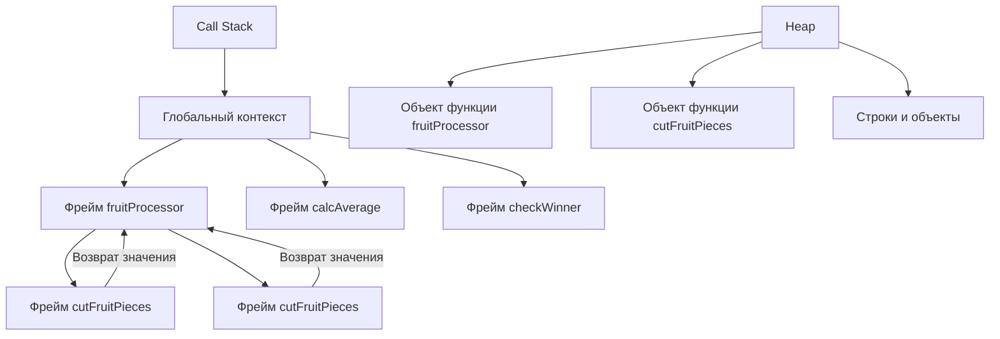

### 1. **Определение функции:**

```javascript
function logger() {
  console.log("Меня зовут Мурад!");
}
```

**Что здесь происходит:**

- **Декларация функции:** Ключевое слово `function` сообщает движку JavaScript, что мы объявляем функцию.

- **Имя функции:** `logger` — это имя функции. Оно сохраняется в памяти (в текущей области видимости) как ссылка на блок кода.

- **Тело функции:** Код внутри `{}` — это тело функции. Оно не выполняется сразу, а сохраняется для последующего выполнения.

**Под капотом:**

- Когда движок JavaScript (например, V8) встречает декларацию функции, он:

1. **Создает функциональный объект** в куче (heap). Этот объект содержит:

- Ссылку на код функции (тело функции).

- Свойства (например, `name` = "logger").

- Область видимости (scope), где была объявлена функция (лексическое окружение).

2. **Сохраняет ссылку** на этот объект в текущей области видимости (например, в глобальной области) под именем `logger`.

**Память на этом этапе:**

```

Global Scope (Стек):

logger: ссылка на объект функции в куче

Куча (Heap):

Объект функции logger:

name: "logger"

code: { console.log('Меня зовут Мурад!'); }

scope: Global Lexical Environment

```

---

### 2. **Вызов функции:**

```javascript
logger();
```

**Что здесь происходит:**

- Когда мы пишем `logger()`, движок JavaScript выполняет функцию.

**Под капотом:**

1. **Создается новый контекст выполнения (execution context)** для этой функции и помещается в **стек вызовов (call stack)**.

```

Call Stack:

| logger()  |  ← Верх стека

| global    |  ← Основание

```

2. Движок **выполняет код внутри тела функции**:

- Встречая `console.log('Меня зовут Мурад!')`, он:

- Ищет `console` в текущей области видимости (находит в глобальном объекте).

- Вызывает метод `log`, передавая ему строку `'Меня зовут Мурад!'`.

- `log` выводит строку в консоль.

3. После выполнения всего кода в теле функции, контекст выполнения `logger` **удаляется из стека**.

---

### 3. **Функции с параметрами и возвратом значения:**

```javascript
function fruitProcessor(apples, oranges) {
  console.log(apples, oranges);

  const juice = `Сок с ${apples} яблоками, и с ${oranges} апельсинами.`;

  return juice;
}
```

**Разберем построчно:**

- **Параметры функции:** `apples` и `oranges` — это **формальные параметры**. Они действуют как локальные переменные внутри функции.

- **Локальные переменные:** `const juice` — переменная, объявленная внутри функции. Она существует только во время выполнения функции.

**Под капотом при вызове `fruitProcessor(5, 0);`:**

1. **Создается контекст выполнения** для `fruitProcessor` и помещается в стек:

```

Call Stack:

| fruitProcessor(5, 0) |

| global               |

```

2. **Аргументы связываются с параметрами:**

- Параметру `apples` присваивается `5`.

- Параметру `oranges` присваивается `0`.

Эти значения хранятся в **лексическом окружении** контекста выполнения функции.

3. **Выполняется тело функции:**

- `console.log(apples, oranges);` → выводит `5 0`.

- Создается переменная `juice` в контексте выполнения. Ей присваивается строка, сформированная с помощью шаблонных литералов.

4. **Инструкция `return juice;`:**

- Движок вычисляет выражение после `return` (здесь это переменная `juice`).

- **Функция завершается**, и контекст выполнения удаляется из стека.

- Значение `juice` (**строка** `'Сок с 5 яблоками, и с 0 апельсинами.'`) **возвращается** в то место, откуда была вызвана функция.

---

### 4. **Использование возвращаемого значения:**

```javascript
const appleJuice = fruitProcessor(5, 0);

console.log(appleJuice);
```

**Что происходит:**

1. Вызов `fruitProcessor(5, 0)`:

- Функция выполняется и **возвращает строку**.

2. Это возвращенное значение **присваивается переменной** `appleJuice`.

3. Теперь `appleJuice` содержит строку и хранится в глобальной области видимости.

**Память после выполнения:**

```

Global Scope (Стек):

appleJuice: 'Сок с 5 яблоками, и с 0 апельсинами.'

Куча (Heap):

Строка: 'Сок с 5 яблоками, и с 0 апельсинами.'

```

---

### 5. **Как работают параметры и аргументы:**

- **Параметры** — это переменные, объявленные в функции (`apples`, `oranges`).

- **Аргументы** — реальные значения, передаваемые в функцию при вызове (`5`, `0`).

**Важно:** В JavaScript аргументы передаются **по значению** (для примитивов) или **по ссылке** (для объектов). В нашем примере числа `5` и `0` передаются по значению, поэтому функция работает с их копиями.

---

### 6. **Жизненный цикл переменных в функции:**

- Переменные, объявленные внутри функции (как `juice`), создаются при **каждом вызове** и уничтожаются после завершения функции (если на них нет внешних ссылок). Это возможно благодаря тому, что контекст выполнения функции удаляется из стека.

---

### 💡 Ключевые концепции для собеседования:

1. **Call Stack (Стек вызовов):**

- Структура данных, которая отслеживает текущие выполняемые функции.

- Работает по принципу LIFO (Last In, First Out).

- При переполнении возникает ошибка "stack overflow".

2. **Heap (Куча):**

- Область памяти для хранения объектов (включая функции, строки, массивы).

- Управляется сборщиком мусора (Garbage Collector).

3. **Параметры vs Аргументы:**

- Параметры — это имена в объявлении функции.

- Аргументы — фактические значения, переданные при вызове.

4. **`return`:**

- Прекращает выполнение функции.

- Возвращает значение в место вызова.

- Без `return` функция возвращает `undefined`.

5. **Локальные переменные:**

- Существуют только во время выполнения функции.

- Изолированы от внешнего кода.

---

**Проверка понимания:**

1. Что выведет этот код?

```javascript
function test(x) {
  return x * 2;
}

const result = test(3);

console.log(result);
```

**Ответ:** `6`.

2. Что хранится в куче, а что в стеке для этого кода?

```javascript
function createUser(name) {
  return { name };
}

const user = createUser("Alex");
```

**Ответ:**

- В **стеке**: переменные `name` (во время вызова функции) и `user` (ссылка на объект).

- В **куче**: объект `{ name: 'Alex' }`.

---

**Разбор Текста Автора:**

**1. Объявление Функции (Function Declaration):**

```javascript
function calcAge1(birthYear) {
  return 2037 - birthYear;
}
```

- **`function`**: Ключевое слово, сигнализирующее движку JS: "Сейчас будет объявление функции".
- **`calcAge1`**: Имя функции. **Ключевой момент под капотом:** При объявлении функции (Function Declaration) её имя (`calcAge1`) **сразу** становится идентификатором в текущей области видимости (чаще всего - глобальной или области видимости функции, внутри которой она объявлена).
- **`(birthYear)`**: Параметры функции. **Под капотом:** При _вызове_ функции в текущем контексте выполнения создаются локальные переменные (здесь - `birthYear`), которым присваиваются переданные аргументы.
- **`{ return 2037 - birthYear; }`**: Тело функции. **Под капотом:**
  - При вызове функции создаётся новый **Контекст Выполнения (Execution Context)** для этой функции. Он помещается на вершину **Стека Вызовов (Call Stack)**.
  - Внутри этого контекста создаётся **Объект Переменных (Variable Environment)** или **Lexical Environment**, который хранит аргументы, локальные переменные (объявленные через `var`, `let`, `const` внутри функции), а также ссылки на внешнее лексическое окружение (для замыканий).
  - Инструкция `return` вычисляет выражение `2037 - birthYear`.
  - Результат вычисления (`2037 - birthYear`) помещается в место вызова функции.
  - Контекст выполнения этой функции завершается и **удаляется из Стека Вызовов**. Управление возвращается в контекст, из которого функция была вызвана (например, глобальный контекст).
  - Память, занятая локальными переменными функции (если на них нет внешних ссылок - замыканий), становится доступной для сборщика мусора (Garbage Collector), который работает с **Кучой (Heap)**.

**2. Вызов объявленной функции:**

```javascript
console.log(calcAge1(1991)); // 46
const age1 = calcAge1(1991);
console.log(age1); // 46
age1(1991); // ОШИБКА! TypeError: age1 is not a function
```

- **`calcAge1(1991)`**: Вызов функции.
  - **Под капотом:** Движок JS ищет идентификатор `calcAge1` в текущей области видимости (и по цепочке областей видимости, если не находит). Находит ссылку на объект функции.
  - Создаётся новый контекст выполнения для `calcAge1`, помещается в стек.
  - Аргумент `1991` присваивается параметру `birthYear` внутри этого контекста.
  - Выполняется тело функции (`return 2037 - 1991` -> `46`).
  - Результат (`46`) возвращается в место вызова.
  - Контекст `calcAge1` удаляется из стека.
- **`console.log(...)`**: Выводит возвращённое значение (`46`) в консоль.
- **`const age1 = calcAge1(1991);`**:
  - Происходит вызов `calcAge1(1991)` (шаги выше).
  - Возвращённое значение (`46`, число) сохраняется в **переменную** `age1` (в её ячейку памяти). `age1` теперь содержит **примитивное значение `46`**, а **не функцию**!
- **`console.log(age1);`**: Выводит значение переменной `age1` (`46`).
- **`age1(1991);`**: **Ошибка!** Потому что `age1` - это число (`46`), а не функция. Вы не можете вызвать число как функцию. Это важная ошибка в примере автора, демонстрирующая разницу между сохранением _результата_ функции и самой _функции_.

**3. Выражение Функции (Function Expression) / Анонимная Функция:**

```javascript
const calcAge2 = function (birthYear) {
  return 2037 - birthYear;
};
```

- **`function(birthYear) { ... }`**: Это **анонимная функция** (у неё нет имени после `function`). Сама по себе эта конструкция - **значение типа "функция"**.
- **`const calcAge2 = ...`**:
  - Объявляется **константа** `calcAge2`.
  - **Под капотом:** В памяти (чаще в **Куче (Heap)** создаётся объект, представляющий анонимную функцию. Этот объект содержит код функции, свойства (имя, если есть - здесь нет, длина, prototype) и ссылки на окружение.
  - **Ссылка (адрес в памяти)** на этот функциональный объект присваивается переменной `calcAge2`.
- **Ключевое отличие от объявления:** Идентификатор `calcAge2` получает значение (ссылку на функцию) **только в момент выполнения этой строки кода**, а не на этапе компиляции/инициализации, как при объявлении функции. Это приводит к различию в **"Поднятии" (Hoisting)**.

**4. Выражение Функции: Вызов и Сохранение**

```javascript
console.log(calcAge2(1991)); // 46
const age2 = calcAge2(1991);
console.log(age2); // 46
age2(1991); // ОШИБКА! (По той же причине, что и с age1)
```

Работает аналогично вызову объявленной функции. Важно: `calcAge2` содержит **ссылку на функцию**, поэтому вызов `calcAge2(...)` возможен. `age2` содержит **число** (результат вызова), поэтому вызов `age2(...)` приводит к ошибке.

**5. Различия: Hoisting (Поднятие)**

- **Объявление Функции (Function Declaration):** **Полностью "поднимается" (hoisted)** наверх своей области видимости во время фазы **компиляции**. Это значит, что движок JS знает о существовании функции и её коде _до_ того, как выполнится строка с её объявлением. Поэтому вызов `calcAge1(1991)` _перед_ объявлением `function calcAge1() {...}` **работает**.
- **Выражение Функции (Function Expression):** **Не "поднимается"** как целое. Переменная (`calcAge2`) объявляется (если через `var` - поднимается со значением `undefined`, если через `let`/`const` - находится во "временной мёртвой зоне" до объявления), но **присвоение ей функции (значения) происходит только при выполнении строки `const calcAge2 = function(...) {...}`**. Поэтому попытка вызвать `calcAge2(...)` **до** этой строки кода вызовет ошибку (`undefined` не функция или ReferenceError для `let`/`const`).

**6. Стрелочные Функции (Arrow Functions):**

```javascript
const calcAge3 = (birthYear) => {
  return 2037 - birthYear;
};
// Или коротко:
const calcAge3 = (birthYear) => 2037 - birthYear;
```

- **`(birthYear) => { ... }`** или **`birthYear => 2037 - birthYear`**: Это синтаксис стрелочной функции. Это всегда **выражение функции (function expression)**, часто анонимное.
- **`const calcAge3 = ...`**: Присваивание ссылки на функцию-стрелку переменной `calcAge3`.
- **Под капотом (Создание):** Как и для обычного выражения функции, в куче создаётся объект функции-стрелки. **Ключевые отличия стрелки:**
  - **Нет собственного `this`:** Внутри стрелки `this` берется из **лексического окружения (Lexical Environment)**, в котором стрелка была **создана** (а не вызвана, как у обычных функций). Это критически важно для понимания!
  - **Нет собственного объекта `arguments`.**
  - **Не может быть использована как конструктор** (с `new`).
  - **Нет свойства `prototype`.**

**7. Синтаксис Стрелок:**

- **Один параметр:** Можно без `()`: `birthYear => ...`
- **Нет параметров:** Обязательно `()`: `() => ...`
- **>1 параметра:** Обязательно `()`: `(year, name) => ...`
- **Одно выражение в теле:** Можно без `{}` и `return`. Результат выражения автоматически возвращается: `birthYear => 2037 - birthYear`.
- **Многострочное тело / Несколько выражений:** Обязательно `{}` и нужен явный `return` для возврата значения: `(birthYear, name) => { const age = ...; return ...; }`.

**8. Вызов и Сохранение Результата Стрелочной Функции:**

```javascript
console.log(calcAge3(1991)); // 46
const age3 = calcAge3(1991);
console.log(age3); // 46
age3(1991); // ОШИБКА! (age3 - число)
```

Работает идентично вызову функции, созданной через выражение. `calcAge3` содержит **ссылку на функцию-стрелку**, вызов возможен. `age3` содержит **число**.

**9. Пример с несколькими параметрами и логикой:**

```javascript
const yearsUntilRetirement = (birthYear, firstName) => {
  const age = 2037 - birthYear;
  const retirement = 65 - age;
  return `${firstName} выйдет на пенсию через ${retirement} лет`;
};
console.log(yearsUntilRetirement(1991, "Jonas")); // Jonas выйдет на пенсию через 19 лет
```

- **Под капотом при вызове:**
  1.  Создаётся контекст выполнения для `yearsUntilRetirement`.
  2.  В его лексическом окружении создаются переменные для параметров (`birthYear=1991`, `firstName='Jonas'`) и локальных констант (`age=46`, `retirement=19`).
  3.  Выполняется шаблонная строка `` `${firstName} выйдет...` ``.
  4.  Результат (строка) возвращается через `return`.
  5.  Контекст удаляется из стека. Локальные переменные `age` и `retirement` становятся недоступны (сборщик мусора может их очистить).
  6.  Возвращённая строка передаётся в `console.log`.

**10. Ключевое: Отсутствие `this` в стрелочных функциях**

- **`У стрелочных функции ... нету ключевое слово this.`** - Это абсолютно верно и **КРИТИЧЕСКИ ВАЖНО**.
- **Под капотом:**
  - У обычных функций значение `this` определяется **во время вызова** (динамически): кто вызвал функцию? (контекст вызова). Оно может меняться.
  - **Стрелочные функции НЕ ИМЕЮТ собственного `this`.** Внутри стрелки `this` - это значение `this` из **лексического окружения (Lexical Environment)**, в котором стрелка была **определена (создана)**. Оно **фиксировано** при создании стрелки и не меняется при её вызове разными способами. Это поведение называется **"лексический `this`"**.
- **Для собеседования:** Объясните это различие обязательно! Приведите пример, где `this` в обычной функции и стрелке ведет себя по-разному внутри метода объекта или обработчика события.

---

**Глубинное Понимание для Собеседования:**

1.  **Функции как Объекты Первого Класса (First-Class Citizens):** Функции в JS - это значения (как числа, строки). Их можно:

    - Присваивать переменным (`const func = function(){}` / `const func = () => {}`)
    - Передавать как аргументы другим функциям (колбэки - `setTimeout(func, 1000)`)
    - Возвращать из других функций (замыкания - `function createCounter() { let count=0; return () => count++; }`)
    - Хранить в структурах данных (`const arr = [function(){...}]`)

2.  **Тип Данных Функции:** Хотя технически функции - это объекты, оператор `typeof function(){}` возвращает `"function"`. Это специальный подтип объекта.

3.  **Этапы Выполнения Кода:**

    - **Загрузка:** Код загружается.
    - **Компиляция (Parsing & Compilation):** Движок (например, V8 в Chrome/Node.js) разбирает (парсит) код в Абстрактное Синтаксическое Дерево (AST). Происходит **Hoisting**:
      - Объявления функций (`function foo(){}`) полностью "поднимаются".
      - Объявления переменных (`var x;`) поднимаются, инициализируются `undefined`.
      - `let`/`const` объявляются, но не инициализируются (временная мёртвая зона).
    - **Интерпретация / Выполнение (Execution):** Код выполняется построчно. Создаются и уничтожаются **Контексты Выполнения**, управляемые **Стеком Вызовов (Call Stack)**. Для JIT-компиляторов (V8) "горячий" код (выполняемый много раз) может быть скомпилирован в машинный код для оптимизации.

4.  **Память: Стек (Call Stack) vs Куча (Heap):**

    - **Стек Вызовов (Call Stack):** Упорядоченная структура (LIFO - Last In, First Out). Хранит **Контексты Выполнения** (Execution Contexts). Каждый вызов функции создаёт новый контекст и помещает его наверх стека. Когда функция завершается (возвращает значение), её контекст удаляется из стека. Хранит примитивы и ссылки на объекты в куче. Быстрый доступ, ограниченный размер.
    - **Куча (Heap):** Неструктурированная область памяти. Хранит **объекты** (включая объекты функций, массивы, даты, DOM-элементы, большие данные). Переменные в стеке (или свойства других объектов) хранят **ссылки (адреса памяти)** на эти объекты в куче. Управление памятью в куче сложнее, доступ медленнее. Сборщик мусора (Garbage Collector) автоматически находит и удаляет объекты, на которые больше нет ссылок из активных частей программы (стека или других объектов в куче).

5.  **Контекст Выполнения (Execution Context):** "Окружение", в котором выполняется код. Создается при:

    - Запуске скрипта (Глобальный Контекст).
    - Вызове функции.
    - Вызове `eval()` (не рекомендуется). Содержит:
    - **LexicalEnvironment:** Ссылка на текущее лексическое окружение (хранит переменные, функции, параметры, ссылку на внешнее окружение - основу замыканий).
    - **VariableEnvironment:** В ES3 был синонимом LexicalEnvironment. В ES5+ для `var` объявления остаются привязанными к VariableEnvironment контекста функции, в то время как LexicalEnvironment может меняться (например, в блоках).
    - **ThisBinding:** Значение `this` для данного контекста.

6.  **`this` в Деталях (Ключевой вопрос собеса!):**

    - **Обычные функции:** Значение `this` определяется **контекстом вызова** (как функция была вызвана):
      - `func()`: `this` = `undefined` (в strict mode) или глобальный объект (window в браузере, global в Node.js - в non-strict mode).
      - `obj.method()`: `this` = `obj` (объект перед точкой).
      - `func.call(ctx, arg)`, `func.apply(ctx, [args])`, `func.bind(ctx)`: `this` = `ctx` (явное указание).
      - `new ConstructorFunc()`: `this` = вновь созданный пустой объект (связанный с прототипом конструктора).
    - **Стрелочные функции:** Значение `this` определяется **лексическим окружением (Lexical Environment)**, в котором стрелка была **создана**. Оно **фиксировано** и не меняется при вызове. Поиск `this` идет по цепочке областей видимости **вверх**, пока не будет найдено значение `this` из окружающей (нестрелочной) функции или глобального контекста.

7.  **Замыкания (Closures):** Функция "запоминает" (имеет доступ к) лексическое окружение (переменные, параметры внешней функции), в котором она была создана, **даже после того, как внешняя функция завершила выполнение**. Это фундаментально для работы колбэков, модулей, приватных данных. Возникают естественно при возврате функции из функции или передаче функции как колбэка. Созданное замыкание хранится в куче.

---

### 🍎 Часть 1: Вложенные функции (Функции, вызывающие другие функции)

```javascript
function fruitProcessor(apples, oranges) {
  const juice = `Сок с ${apples} яблоками, и с ${oranges} апельсинами.`;
  return juice;
}
```

**Под капотом:**

1. **Объявление функции**: При запуске кода движок JS (например, V8 в Chrome) создает функцию в **куче (heap)**.
2. **Параметры как локальные переменные**: `apples` и `oranges` существуют только в **стеке вызовов (call stack)** во время выполнения функции.
3. **Создание переменной**: `const juice` сохраняется в стеке на время выполнения функции.
4. **Возврат значения**: `return` передает значение обратно в вызывающий код и **удаляет текущий фрейм функции из стека**.

---

```javascript
function cutFruitPieces(fruit) {
  return fruit * 4;
}
```

**Под капотом:**

- При вызове создается новый **контекст выполнения** в стеке:
  ```mermaid
  graph LR
    A[Call Stack] --> B[fruitProcessor frame]
    B --> C[cutFruitPieces frame]
  ```
- Параметр `fruit` - локальная переменная, уничтожается при завершении функции.

---

```javascript
function fruitProcessor(apples, oranges) {
  const applePieces = cutFruitPieces(apples);
  const orangePieces = cutFruitPieces(oranges);
  const juice = `Сок с ${applePieces} кусочками...`;
  return juice;
}
```

**Процесс выполнения для `fruitProcessor(2, 3)`**:

1. В стеке создается фрейм для `fruitProcessor` с:
   - `apples = 2`
   - `oranges = 3`
2. Вызов `cutFruitPieces(apples)`:
   - Создается **новый фрейм** поверх стека
   - Параметр `fruit = 2`
   - Вычисление `2 * 4 = 8`
   - Фрейм удаляется, возвращается `8`
3. Аналогично для `cutFruitPieces(oranges)`: `3 * 4 = 12`
4. Строка `juice` формируется с значениями 8 и 12
5. Фрейм `fruitProcessor` удаляется, возвращая строку

---

### 🔑 Ключевые концепции (для собеседования)

**1. Стек вызовов (Call Stack):**

- Принцип **LIFO** (Last In, First Out)
- Каждый вызов функции - новый фрейм
- Пример стека для `fruitProcessor(2,3)`:
  ```
  |----------------|
  | cutFruitPieces | <- Выполняется сейчас (для oranges)
  |----------------|
  | cutFruitPieces | <- Завершен (для apples)
  |----------------|
  | fruitProcessor | <- Базовый фрейм
  |----------------|
  ```

**2. Куча (Heap):**

- Хранит объекты, функции, большие данные
- Функции `fruitProcessor` и `cutFruitPieces` хранятся здесь
- Сборщик мусора (Garbage Collector) автоматически удаляет неиспользуемые объекты

**3. Параметры как локальные переменные:**

- Существуют только в своем контексте выполнения
- Пример:
  ```javascript
  function test(a) {
    /* a доступно здесь */
  }
  test(5);
  console.log(a); // ReferenceError: a не определен
  ```

**4. Работа return:**

- Немедленно завершает выполнение функции
- Пример с несколькими return:
  ```javascript
  function example(x) {
    if (x > 10) return "Большое";
    return "Маленькое"; // Выполнится только если x <= 10
  }
  ```

---

### 🏆 Часть 2: Задача с расчетом среднего

```javascript
const calcAverage = (a, b, c) => (a + b + c) / 3;
```

**Под капотом:**

- Стрелочная функция хранится в куче
- При вызове создается фрейм в стеке с параметрами a, b, c
- Примитивы (числа) хранятся в стеке

```javascript
const scoreDolphins = calcAverage(44, 23, 71);
const scoreKoalas = calcAverage(65, 54, 49);
```

- Результаты (46 и 56) сохраняются в переменных в **глобальном контексте выполнения**

---

```javascript
const checkWinner = function (avgDolphins, avgKoalas) {
  if (avgDolphins >= 2 * avgKoalas) {
    console.log(`Dolphins win (${avgDolphins} vs. ${avgKoalas})`);
  }
  // ... else логика
};
```

**Процесс вызова `checkWinner(scoreDolphins, scoreKoalas)`**:

1. В стеке создается фрейм с параметрами:
   - `avgDolphins = 46`
   - `avgKoalas = 56`
2. Проверка условий:
   - `46 >= 2*56?` → 46 >= 112? → false
   - `56 >= 2*46?` → 56 >= 92? → false
3. Выполняется блок `else`

---

### 💡 Важные нюансы (для собеседования)

**1. Отсутствие return в checkWinner:**

- Функция возвращает `undefined`
- Поэтому `console.log(checkWinner(...))` выведет сначала результат выполнения функции, затем `undefined`

**2. Независимость параметров:**

```javascript
console.log(checkWinner(300, 100));
```

- Параметры не знают, откуда пришли значения
- Движок просто создает локальные переменные `avgDolphins=300`, `avgKoalas=100`

**3. Разница между объявлением функций:**

- `function name() {}` - всплывает (hoisted)
- `const name = function() {}` - не всплывает
- `const name = () => {}` - не всплывает, нет своего `this`

---

### 🧠 Как это всё работает в памяти?



1. **Примитивы** (числа, строки, булевы): хранятся в стеке
2. **Объекты** (включая функции): хранятся в куче, в стеке хранятся ссылки на них
3. **Контексты выполнения**: создаются/удаляются в стеке
4. **Сборка мусора**: автоматически удаляет из кучи объекты, на которые нет ссылок

---

### ❓ Вопросы для собеседования (и ответы)

**Q1: Что такое стек вызовов?**

> A: Механизм LIFO (последний вошел - первый вышел), который отслеживает текущие выполняемые функции. Каждый вызов создает новый фрейм в стеке.

**Q2: Чем куча отличается от стека?**

> A: Стек хранит примитивы и ссылки на объекты, имеет ограниченный размер. Куча хранит объекты и сложные структуры данных, размер динамически изменяется.

**Q3: Что происходит при вызове функции внутри другой функции?**

> A: Создается новый контекст выполнения, который помещается поверх текущего в стеке вызовов. Когда вложенная функция завершается, её контекст удаляется из стека.

**Q4: Почему параметры функций называют локальными переменными?**

> A: Потому что они создаются при вызове функции и уничтожаются при её завершении, существуя только в пределах своего контекста выполнения.

**Q5: Что делает ключевое слово return?**

> A: 1) Возвращает указанное значение, 2) Немедленно завершает выполнение функции, 3) Удаляет текущий фрейм функции из стека вызовов.

**Q6: Могут ли разные функции иметь параметры с одинаковыми именами?**

> A: Да, потому что каждый контекст выполнения изолирован. Параметр `x` в одной функции и `x` в другой - это разные переменные.

**Q7: Что выведет `console.log(checkWinner(300, 100))`?**

> A: Сначала вызовется функция, которая выведет "Dolphins win...", затем console.log выведет undefined, так как checkWinner не возвращает явного значения.

---

### 1. Введение в массивы:

Автор начинает с проблемы: хранение нескольких значений (имен друзей) в отдельных переменных неудобно.

```javascript
const friend1 = "Michael";

const friend2 = "Steven";

const friend3 = "Peter";
```

**Объяснение:**

- Каждая переменная (`friend1`, `friend2`, `friend3`) создается в текущей области видимости (в данном случае, глобальной).

- Примитивные значения (строки) хранятся в стеке (stack). Каждая переменная получает свою ячейку памяти, хранящую значение.

- Проблема: если друзей много, управлять сотнями переменных становится сложно.

### 2. Решение: массивы

Автор представляет массивы как контейнер для хранения нескольких значений.

```javascript
const friends = ["Michael", "Steven", "Peter"];
```

**Объяснение:**

- Массив `friends` создается в памяти. В JavaScript массивы являются объектами.

- Переменная `friends` (расположенная в стеке) содержит ссылку (адрес памяти) на место в куче (heap), где хранится сам массив.

- В куче массив хранится как непрерывная область памяти (хотя в JavaScript это не всегда физически непрерывно, но логически). Каждый элемент массива доступен по индексу.

- Индексация начинается с 0: первый элемент имеет индекс 0, второй - 1 и т.д.

### 3. Другой способ создания массива:

```javascript
const years = new Array(1991, 1984, 2008, 2020);
```

**Объяснение:**

- Это вызов конструктора `Array`. Внутри движка это создает массив аналогично литералу `[]`.

- Однако, есть нюанс: если передать один аргумент-число, то будет создан пустой массив с заданной длиной (например, `new Array(3)` создаст массив с `length=3` и без элементов). Поэтому предпочтительнее использовать литерал `[]`.

### 4. Доступ к элементам массива:

```javascript
console.log(friends[0]); // 'Michael'
```

**Объяснение:**

- Для доступа к элементу массива используется синтаксис квадратных скобок и индекс.

- Движок JavaScript, видя `friends[0]`, делает следующее:

1. Находит переменную `friends` в текущей области видимости (стек).

2. Следует по ссылке в кучу, где хранится массив.

3. Берет значение по индексу 0 (первый элемент).

### 5. Свойство length:

```javascript
console.log(friends.length); // 3
```

**Объяснение:**

- У каждого массива есть свойство `length`, которое автоматически обновляется при добавлении/удалении элементов.

- Значение `length` всегда на единицу больше, чем последний индекс (поскольку индексы начинаются с 0).

### 6. Получение последнего элемента:

```javascript
console.log(friends[friends.length - 1]); // 'Peter'
```

**Объяснение:**

- Поскольку индексы начинаются с 0, последний элемент имеет индекс `length - 1`.

- Выражение `friends.length - 1` вычисляется в 2, поэтому мы получаем элемент с индексом 2.

### 7. Изменение элемента массива:

```javascript
friends[2] = "Jay";

console.log(friends); // ["Michael", "Steven", "Jay"]
```

**Объяснение:**

- Мы заменяем элемент с индексом 2 на новое значение.

- Почему это разрешено, если `friends` объявлена как `const`?

- `const` означает, что нельзя переприсвоить саму переменную `friends` (т.е. нельзя сделать `friends = другой_массив`).

- Но содержимое массива (элементы) можно менять, потому что переменная `friends` хранит ссылку, а не сам массив. Замена элемента не меняет ссылку.

### 8. Ошибка при попытке перезаписать переменную:

```javascript
friends = ["Bob", "Alice"]; // Ошибка!
```

**Объяснение:**

- Здесь мы пытаемся присвоить переменной `friends` новый массив. Но `const` запрещает изменение ссылки, хранящейся в переменной. Поэтому возникает ошибка.

### 9. Массивы могут содержать разные типы:

```javascript
const firstName = "Jonas";

const jonas = [firstName, "Rabadanov", 2024 - 1995, "teacher", friends];
```

**Объяснение:**

- Массивы в JavaScript могут содержать элементы любых типов: строки, числа, другие массивы и т.д.

- При создании массива, выражения внутри вычисляются. Например, `2024 - 1995` вычисляется в 29.

- Переменная `friends` подставляется по ссылке, поэтому в массиве `jonas` последний элемент - это ссылка на тот же массив, на который указывает `friends`.

### 10. Передача массива в функцию:

```javascript
console.log(calcAge(years)); // NaN
```

**Объяснение:**

- Функция `calcAge` ожидает число (год рождения), а мы передаем целый массив `years`.

- При выполнении `2037 - birthYear` получаем `2037 - [массив]`, что приводит к `NaN` (Not a Number), потому что массив не может быть преобразован в число в данном контексте.

### 11. Корректное использование функции для элементов массива:

```javascript
const age1 = calcAge(years[0]); // 47

const age2 = calcAge(years[1]); // 70

const age3 = calcAge(years[years.length - 1]); // 19
```

**Объяснение:**

- Здесь мы передаем в функцию каждый элемент массива (число) по отдельности, что корректно.

### 12. Создание массива из результатов вызова функции:

```javascript
const ages = [
  calcAge(years[0]),
  calcAge(years[1]),
  calcAge(years[years.length - 1]),
];

console.log(ages); // [47, 70, 19]
```

**Объяснение:**

- При создании массива `ages` каждое выражение внутри вычисляется. То есть сначала вызывается функция `calcAge` для каждого указанного элемента массива `years`, и возвращаемые значения (числа) помещаются в новый массив.

---

### Как это все работает под капотом?

#### Память: стек (stack) и куча (heap)

- **Стек:** область памяти для хранения примитивов и ссылок на объекты. Работает по принципу LIFO (последним пришел - первым ушел). Здесь же хранятся вызовы функций (стек вызовов - call stack).

- **Куча:** область динамической памяти, где хранятся объекты (включая массивы). Размер кучи может меняться, и здесь работает сборщик мусора (garbage collector).

**Пример с массивом:**

1. При создании массива `friends`:

- В стеке создается переменная `friends`.

- В куче создается объект (массив) с элементами.

- Переменная `friends` получает адрес (ссылку) этого объекта в куче.

2. Когда мы обращаемся к `friends[0]`:

- Движок идет по ссылке из стека в кучу, находит массив и берет нулевой элемент.

#### Выполнение кода и функции

- Когда вызывается функция (например, `calcAge(years[0])`), в стеке вызовов создается новый фрейм (frame) для этой функции.

- Параметры и локальные переменные функции хранятся в этом фрейме.

- После выполнения функции фрейм удаляется из стека.

#### Const и изменяемость

- `const` запрещает изменение значения в переменной (для примитивов) или изменение ссылки (для объектов). Но содержимое объекта (если оно изменяемое, как у массива) можно менять.

#### Интерпретатор и компилятор в JavaScript

- JavaScript - интерпретируемый язык, но современные движки (V8 в Chrome, SpiderMonkey в Firefox) используют JIT-компиляцию (Just-In-Time).

- **Интерпретатор:** выполняет код построчно.

- **JIT-компилятор:** компилирует часто выполняемый код (hot code) в машинный код для ускорения.

**Процесс выполнения кода:**

1. **Парсинг:** исходный код разбивается на токены и преобразуется в AST (Abstract Syntax Tree).

2. **Компиляция:** байт-код или машинный код генерируется JIT-компилятором.

3. **Выполнение:** движок выполняет скомпилированный код.

#### Сборка мусора (Garbage Collection)

- В куче память управляется автоматически. Когда объект (например, массив) больше не доступен (нет ссылок на него), сборщик мусора освобождает память.

---

### Вопросы на собеседовании и ответы:

1. **Чем отличается `const` для массива от `const` для числа?**

- Для числа (примитив) `const` означает, что значение нельзя изменить.

- Для массива (объект) `const` означает, что нельзя изменить ссылку на массив, но сам массив (его элементы) можно менять.

2. **Почему индексация массивов начинается с 0?**

- Исторически сложилось в языках программирования (C, Java). Это связано с адресацией памяти: индекс 0 означает смещение 0 от начала массива.

3. **Где хранятся массивы в памяти?**

- В куче (heap). Переменная в стеке хранит ссылку на массив в куче.

4. **Как работает свойство `length`?**

- Это свойство автоматически обновляется при изменении массива. Оно всегда равно наибольшему индексу плюс один.

5. **Может ли массив содержать элементы разных типов?**

- Да, в JavaScript массивы могут содержать любые типы данных, включая другие массивы и объекты.

6. **Что произойдет, если передать массив в функцию, ожидающую число?**

- Результат будет `NaN`, потому что массив не преобразуется в число в арифметической операции.

7. **Как создать массив из результатов вызова функции?**

- Можно использовать вызовы функции внутри литерала массива: `[func(a), func(b)]`.

8. **Чем массив отличается от объекта?**

- Массив - это специальный тип объекта, предназначенный для хранения упорядоченных коллекций. У него есть свойство `length` и методы для работы с элементами (push, pop и т.д.).

9. **Что такое разреженный массив?**

- Это массив, в котором есть "дыры" (не все индексы имеют значения). Например, `const arr = [1, , 3];`.

10. **Как узнать, является ли объект массивом?**

- Использовать `Array.isArray(obj)`.

---

### Часть 1: Основные операторы (методы) массивов

**Текст:**

> В JS есть встроенные функции которые мы можем применять для наших массивов. Они называются методы (method). Мы можем рассматривать методы как операции с массивами.

**Объяснение:**

- **Методы массивов** — это функции, прикрепленные к объектам массивов. В JavaScript массивы являются объектами, и у них есть встроенные методы (функции), которые можно вызывать для выполнения операций над массивом.

- **Как это работает под капотом:** Когда вы создаете массив, например, `const arr = [];`, движок JS создает объект массива, который наследует свойства и методы из `Array.prototype`. Поэтому все методы (например, `push`, `pop`) доступны через прототип.

---

### Метод `push()`

**Текст:**

> Пример:

> `const friends = ['Michael', 'Steven', 'Peter'];`

> `friends.push('Jay');`

> `console.log(friends); // ["Michael", "Steven", "Peter", "Jay"]`

**Объяснение:**

- **Что делает `push`:** Добавляет один или несколько элементов в **конец** массива.

- **Возвращаемое значение:** Длина нового массива.

- **Пример с сохранением длины:**

```javascript
const newLength = friends.push("Jay");

console.log(newLength); // 4
```

**Как это работает под капотом:**

1. **Вызов метода `push`:**

- Движок JS обращается к массиву `friends`.

- Находит метод `push` в `Array.prototype`.

2. **Изменение массива:**

- В памяти массив представлен как непрерывная область (хотя в JS это динамические структуры).

- При добавлении элемента:

- **Если есть место в выделенной памяти:** элемент добавляется в конец.

- **Если нет места:** движок выделяет новый блок памяти, копирует туда старый массив и добавляет новый элемент.

3. **Возврат длины:**

- После добавления возвращается новая длина массива.

4. **Работа с памятью:**

- Сам массив хранится в **куче (heap)**.

- Переменная `friends` хранит **ссылку** на этот массив.

- При изменении массива изменяется объект в куче, а все ссылки остаются действительными.

---

### Метод `unshift()`

**Текст:**

> `friends.unshift('John');`

> `console.log(friends); // ["John", "Michael", "Steven", "Peter", "Jay"]`

**Объяснение:**

- **Что делает `unshift`:** Добавляет элемент в **начало** массива.

- **Эффективность:** Менее эффективен, чем `push`, потому что требует сдвига всех существующих элементов на одну позицию вправо.

**Под капотом:**

1. **Алгоритм:**

- Выделяется память под новый массив (если нужно).

- Все элементы сдвигаются на 1 позицию вправо.

- Новый элемент помещается на позицию `0`.

2. **Сложность:** O(n), где n — длина массива. Для больших массивов это может быть медленно.

---

### Метод `pop()`

**Текст:**

> `friends.pop();`

> `console.log(friends); // ["John", "Michael", "Steven", "Peter"]`

> `const popped = friends.pop();`

> `console.log(popped); // "Jay"`

**Объяснение:**

- **Что делает `pop`:** Удаляет **последний** элемент массива.

- **Возвращаемое значение:** Удаленный элемент.

**Под капотом:**

1. **Алгоритм:**

- Движок уменьшает длину массива на 1.

- Возвращает элемент, который был на последней позиции.

2. **Память:**

- Элемент удаляется из кучи, но сборщик мусора (garbage collector) очистит память, если на этот элемент больше нет ссылок.

---

### Метод `shift()`

**Текст:**

> `friends.shift(); // удаляет "John"`

> `console.log(friends); // ["Michael", "Steven", "Peter"]`

**Объяснение:**

- **Что делает `shift`:** Удаляет **первый** элемент массива.

- **Возвращаемое значение:** Удаленный элемент.

- **Эффективность:** O(n), так как требует сдвига всех элементов на одну позицию влево.

---

### Методы `indexOf()` и `includes()`

**Текст:**

> `console.log(friends.indexOf('Peter')); // 2`

> `console.log(friends.includes('Peter')); // true`

> `console.log(friends.includes(23)); // false (если 23 есть в массиве)`

> `console.log(friends.includes('23')); // false (строгая проверка)`

**Объяснение:**

- **`indexOf()`** возвращает индекс элемента или `-1`, если элемент не найден.

- **`includes()`** возвращает `true`/`false` в зависимости от наличия элемента.

- **Строгое равенство:** Оба метода используют строгое сравнение (`===`), поэтому `23` (число) и `'23'` (строка) — разные.

**Под капотом:**

- **Алгоритм поиска:** Линейный поиск (O(n)). Движок перебирает элементы массива до первого совпадения.

---

### Часть 2: Задача (расчет чаевых)

**Текст:**

```javascript
const calcTip = function (bill) {
  return bill >= 50 && bill <= 300 ? bill * 0.15 : bill * 0.2;
};

// Стрелочная версия:

const calcTip = (bill) =>
  bill >= 50 && bill <= 300 ? bill * 0.15 : bill * 0.2;

const bills = [125, 555, 44];

const tips = [calcTip(bills[0]), calcTip(bills[1]), calcTip(bills[2])];

const totals = [bills[0] + tips[0], bills[1] + tips[1], bills[2] + tips[2]];

console.log(totals); // [143.75, 666, 52.8]
```

**Объяснение:**

1. **Функция `calcTip`:**

- Принимает сумму счета.

- Возвращает чаевые: 15% если счет между 50 и 300, иначе 20%.

2. **Создание массивов:**

- `bills`: исходные счета.

- `tips`: массив чаевых, рассчитанных вызовом `calcTip` для каждого элемента `bills`.

- `totals`: сумма счета и чаевых для каждого индекса.

**Как это работает под капотом:**

- **Вызов функции:** Каждый вызов `calcTip(...)` помещается в **стек вызовов (call stack)**:

```javascript
tips = [
  calcTip(bills[0]), // 1. bills[0] = 125 -> 125 * 0.15 = 18.75

  calcTip(bills[1]), // 2. bills[1] = 555 -> 555 * 0.2 = 111

  calcTip(bills[2]), // 3. bills[2] = 44 -> 44 * 0.2 = 8.8
];
```

- **Создание `totals`:**

```javascript
totals = [
  125 + 18.75, // 143.75

  555 + 111, // 666

  44 + 8.8, // 52.8
];
```

- **Память:**

- Массивы `bills`, `tips`, `totals` хранятся в **куче**.

- Примитивные значения (числа) хранятся непосредственно в массиве.

- Стек вызовов управляет контекстом выполнения функций.

---

### Ключевые термины для собеседования:

1. **Стек вызовов (Call Stack):**

- LIFO-стек (последним пришел — первым ушел), который отслеживает текущие функции в выполнении.

- При вызове функции — она помещается в стек, при завершении — удаляется.

2. **Куча (Heap):**

- Область памяти для хранения объектов (массивы, объекты). Переменные хранят ссылки на объекты в куче.

3. **Примитивы vs Объекты:**

- Примитивы (числа, строки) хранятся в стеке (или непосредственно в переменных).

- Объекты (включая массивы) хранятся в куче.

4. **Строгое равенство (===):**

- Сравнение без приведения типов. `23 === '23'` → `false`.

---

### 1. Сравнение массивов и объектов

**Текст:**

> "Мы уже знаем что в массивах можно хранить несколько элементов, разных типов данных. Точно также мы можем хранить несколько элементов и в объектах, но разница в том что в объектах мы можем дать имена (Свойствы) для каждого элемента то есть для каждой значении"

**Разбор:**

- **Массивы** — это упорядоченные коллекции данных, где каждый элемент имеет числовой индекс (начиная с 0). Элементы могут быть любого типа: числа, строки, другие массивы, объекты и т.д.

```javascript
const arr = [1, "hello", true, [2, 3]];
```

- Доступ к элементам: по индексу (например, `arr[1]` вернет `'hello'`).

- **Объекты** — это неупорядоченные (на самом деле, порядок свойств в объектах сохраняется, но это не основная их характеристика) коллекции данных в формате _ключ-значение_. Ключи (свойства) — это строки (или символы), а значения могут быть любыми типами данных.

```javascript
const obj = {
  key1: "value1",

  key2: 42,

  key3: true,
};
```

- Доступ к значениям: по ключу (например, `obj.key1` или `obj['key1']`).

**Под капотом:**

- В памяти массив — это особый вид объекта, где числовые индексы автоматически преобразуются в строки (например, индекс `0` становится строкой `'0'`). Но движок JS оптимизирует массивы для быстрого доступа по индексу.

- Объект в памяти (в куче, heap) хранится как хеш-таблица (или похожая структура) для быстрого доступа по ключу. Каждое свойство объекта — это запись в этой таблице.

---

### 2. Создание объекта и его свойства

**Текст:**

> "Пример объекта:

> ```javascript
>
> ```

> const jonas = {

> firstName: 'Jonas', // свойство (ключ) / Значение

> lastName: 'Rabadanov',

> age: 2037 - 1995,

> job: 'teacher',

> friends: ['Michael', 'Peter', 'Steven']

> }

> ```
>
> ```

> И так у нас есть объект с пяти парами свойств с пяти парами ключа, и каждого ключа есть значения."

**Разбор:**

- Объект `jonas` создан с помощью литерала объекта `{}`.

- Свойства (ключи) и их значения разделены двоеточием `:`, а пары разделены запятыми.

- Значения могут быть вычисляемыми выражениями (как `age: 2037 - 1995`), которые вычисляются в момент создания объекта.

- Значения могут быть любого типа, включая массивы (`friends`).

**Под капотом:**

- Когда движок JS встречает такой литерал объекта:

1. Создается новый объект в куче (heap).

2. Вычисляются все выражения в значениях (например, `2037 - 1995` станет `42`).

3. Пары ключ-значение добавляются в объект.

- Переменная `jonas` (в стеке) хранит ссылку на этот объект в куче.

---

### 3. Доступ к свойствам объекта

**Текст:**

> "Таким образом мы присвоили имена (свойствы, ключи) этим значениям, что было не возможно в массивах. [...] в объектах порядок следования значений вообще не имеет значение [...] мы обращаемся к его имени к свойству этой значении"

**Разбор:**

- В массивах доступ только по индексу, в объектах — по ключу.

- Два способа доступа к свойствам:

1. **Через точку:** `jonas.firstName` → 'Jonas'

2. **Через квадратные скобки:** `jonas['firstName']` → 'Jonas'

- Квадратные скобки позволяют использовать динамические ключи:

```javascript
const key = "Name";

console.log(jonas["first" + key]); // 'Jonas'
```

**Под капотом:**

- При обращении к свойству (например, `jonas.firstName`):

1. Движок ищет свойство `firstName` в самом объекте `jonas`.

2. Если не находит, идет по цепочке прототипов (пока не дойдет до `null`).

- Поиск свойства в объекте оптимизирован движком (например, V8 использует hidden classes для быстрого доступа).

---

### 4. Порядок свойств в объектах

**Текст:**

> "Большая разница между Массивами и Объектами заключается в том, что в объектах порядок следования значений вообще не имеет значение"

**Уточнение:**

- Исторически в JS объекты не гарантировали порядок свойств. Но в современном стандарте (ES2015+) порядок перечисления свойств сохраняется:

- Сначала строковые ключи в порядке добавления.

- Затем символьные ключи (Symbol) в порядке добавления.

- **НО:** не стоит полагаться на порядок в объектах, если нужен порядок — используйте массивы или `Map`.

**Пример:**

```javascript
const obj = { b: 2, a: 1, 1: "one" };

console.log(Object.keys(obj)); // ['1', 'b', 'a'] — числовые ключи сортируются!
```

---

### 5. Создание объектов

**Текст:**

> "Существует несколько способов создание объектов в JS, но данный объект который мы создали используя фигурные скобки {}, является самым простым."

**Другие способы:**

1. Через конструктор `Object`:

```javascript
const obj = new Object();

obj.key = "value";
```

2. Через функции-конструкторы (устаревший способ):

```javascript
function Person(name) {
  this.name = name;
}

const jonas = new Person("Jonas");
```

3. Через `Object.create()`:

```javascript
const parent = { hello: () => console.log("Hello") };

const child = Object.create(parent); // child наследует свойства parent
```

---

### Вопросы с собеседований

1. **Чем объект отличается от массива?**

- Массивы — упорядоченные, доступ по индексу, оптимизированы для последовательностей.

- Объекты — неупорядоченные (но порядок добавления сохраняется), доступ по ключу, хранят произвольные данные.

2. **Как проверить наличие свойства в объекте?**

- `'key' in obj` — проверяет само свойство и прототип.

- `obj.hasOwnProperty('key')` — только собственное свойство.

3. **Что такое методы объекта?**

- Это свойства-функции:

```javascript
const person = {
  name: "Jonas",

  greet() {
    console.log(`Hello, ${this.name}!`);
  },
};
```

---

_ПОЛУЧЕНИЕ ЗНАЧЕНИЙ ИЗ ОБЪЕКТОВ - ТОЧЕЧНАЯ ЗАПИСЬ VS КВАДРАТНЫЕ СКОБКИ_

**Объяснение:**

Заголовок говорит, что мы будем обсуждать два способа доступа к свойствам объекта: точечную запись (например, `obj.property`) и запись через квадратные скобки (например, `obj['property']`).

---

**Текст автора:**

Получение данных из объектов, а также изменение данных в объектах, используя точечную запись и квадратную нотацию. Давайте возьмем наш объект:

```javascript
const jonas = {
  firstName: "Jonas", // свойство (ключ) / Значение

  lastName: "Rabadanov",

  age: 2024 - 1995,

  job: "teacher",

  friends: ["Michael", "Peter", "Steven"],
};
```

**Объяснение:**

1. **Создание объекта `jonas`:**

- Ключевое слово `const` объявляет переменную `jonas` как константу. Это значит, что ссылка на объект не может быть изменена (но сам объект изменять можно).

- В правой части находится объектный литерал `{ ... }`, который создает новый объект в памяти.

- Объект в JavaScript — это структура данных, хранящая пары ключ-значение. Ключи (имена свойств) всегда строки (даже если не заключены в кавычки, они автоматически преобразуются в строки), а значения могут быть любого типа.

2. **Память:**

- Переменная `jonas` помещается в стек (stack). Ее значение — это адрес (ссылка) на объект, расположенный в куче (heap).

- Сам объект `jonas` хранится в куче. В куче выделяется память под все его свойства.

- Примитивные значения (`'Jonas'`, `'Rabadanov'`, результат вычисления `2024-1995` (число 29), `'teacher'`) хранятся непосредственно в объекте (хотя технически, строки как объекты могут храниться в куче, а в объекте хранятся ссылки на них, но для простоты можно считать, что примитивы хранятся в объекте).

- Свойство `friends` содержит массив. Массив — это тоже объект, поэтому в свойстве `friends` хранится ссылка на массив, который расположен отдельно в куче. В этом массиве хранятся три строки.

3. **Вычисление значения `age`:**

- Выражение `2024 - 1995` вычисляется во время создания объекта. В объект запишется число 29.

---

**Текст автора:**

У нас есть два способа получить значения из объекта:

Пример - Точечная запись:

```javascript
console.log(jonas.lastName); // result / Rabadanov
```

Пример - Квадратные скобки:

```javascript
console.log(jonas["lastName"]); // result / Rabadanov
```

**Объяснение:**

1. **Точечная запись:**

- Синтаксис: `объект.ключ`.

- Интерпретатор ищет в объекте `jonas` свойство с именем `'lastName'`.

- Процесс:

- Движок JavaScript (например, V8) проверяет, есть ли у объекта `jonas` свойство `'lastName'`.

- Поиск происходит в самом объекте, а если его там нет, то в цепочке прототипов (но в данном случае свойство есть).

- Найденное значение (строка `'Rabadanov'`) возвращается.

2. **Квадратные скобки:**

- Синтаксис: `объект['ключ']`.

- Внутри скобок указывается строка, которая является именем свойства.

- Процесс:

- Интерпретатор вычисляет выражение внутри скобок. В данном случае это строка `'lastName'`.

- Затем ищет в объекте свойство с таким именем.

- Возвращает значение.

**Под капотом (разница в производительности):**

- Точечная запись немного быстрее, потому что:

- Интерпретатору не нужно вычислять выражение (имя свойства задано явно).

- На этапе компиляции (в JIT-компиляторе, например, TurboFan в V8) может быть применена оптимизация: компилятор знает точное смещение свойства в структуре объекта (благодаря скрытым классам).

- Квадратные скобки требуют вычисления выражения внутри (хотя в данном случае это просто строка) и затем поиска по имени. Это может быть медленнее, но разница незначительна.

---

**Текст автора:**

Разница между точечной записью и квадратной нотацией в том, что в квадратных скобках `[]` мы можем использовать любое выражение, которое дает значение.

Пример:

```javascript
const nameKey = "Name";

console.log(jonas["first" + nameKey]); // result / Jonas

console.log(jonas["last" + nameKey]); // result / Rabadanov
```

**Объяснение:**

1. **Выражение внутри квадратных скобок:**

- В квадратных скобках можно использовать любое выражение, результатом которого является строка (или значение, которое может быть преобразовано в строку). Это выражение вычисляется во время выполнения.

- В примере: `'first' + nameKey` — это выражение конкатенации строк. Переменная `nameKey` содержит строку `'Name'`, поэтому:

- `'first' + 'Name'` → `'firstName'`.

- `'last' + 'Name'` → `'lastName'`.

2. **Процесс доступа:**

- Для `jonas['first' + nameKey]`:

- Вычисляется выражение: `'first' + nameKey` → `'firstName'`.

- Затем движок обращается к объекту `jonas` и ищет свойство с именем `'firstName'`.

- Находит и возвращает `'Jonas'`.

3. **Почему так можно делать?**

- Квадратные скобки принимают строку, которая является именем свойства. Поскольку выражение вычисляется в строку, это позволяет динамически генерировать имена свойств.

4. **Память и выполнение:**

- Переменная `nameKey` хранится в стеке (как часть текущего контекста выполнения). Ее значение (`'Name'`) — строка, которая хранится в куче.

- При вычислении `'first' + nameKey` создается новая строка `'firstName'` (в куче). После использования она может быть удалена сборщиком мусора.

---

**Текст автора:**

Но с точечной записью это не сработает. В точечной записи нам нужно указывать настоящее имя свойства как оно указано в объекте.

Пример:

```javascript

console.log(jonas.'first' + nameKey); // result / Uncaught SyntaxError: Unexpected string

```

**Объяснение:**

- Точечная запись требует, чтобы идентификатор (имя свойства) был указан буквально, без вычислений.

- В примере: `jonas.'first' + nameKey` — это синтаксическая ошибка, потому что после точки ожидается идентификатор (без кавычек). Здесь же написана строка `'first'`, что недопустимо.

- Точечная запись не поддерживает динамическое формирование имени свойства.

---

**Текст автора:**

А теперь чтобы еще больше прояснить необходимость использования квадратных скобок, я покажу вам еще один пример: Допустим, мы еще не знаем, какое свойство мы хотим получить из объекта, вместо этого мы получаем информацию из пользовательского интерфейса.

Для этого мы можем использовать функцию `prompt()`:

Как мы знаем, эта функция вернет строку в консоле, и мы можем сохранить его в переменной.

```javascript
const interestedIn = prompt(
  "Что вы хотите узнать о Jonas? Выберите между firstName, lastName, age, job, и friends."
);

console.log(interestedIn); // result / input(job) console(job)

// result / Во всплывающем окне получим input для того чтобы мы ввели одно из свойств объекта jonas, и после мы получим данное свойство в консоле.
```

**Объяснение:**

1. **Функция `prompt`:**

- Это встроенная функция браузера, которая отображает диалоговое окно с запросом на ввод текста.

- Возвращает строку, введенную пользователем (или `null`, если пользователь отменил ввод).

2. **Переменная `interestedIn`:**

- В стеке (в текущем контексте выполнения) создается переменная `interestedIn`.

- Ее значение — строка, введенная пользователем (например, `'job'`). Сама строка хранится в куче.

3. **Вывод в консоль:**

- `console.log(interestedIn)` выведет в консоль введенную строку.

---

**Текст автора:**

А теперь чтобы получить значение из этих свойств, мы используем квадратные скобки `[]`, обращаясь к объекту `jonas` и мы знаем что квадратные скобки принимают любое выражение, которое будет интересно из свойств объекта `jonas`.

Пример:

```javascript
console.log(jonas[interestedIn]); // result / input(job) console(teacher)
```

**Объяснение:**

- Здесь `interestedIn` — переменная, содержащая строку (например, `'job'`).

- Выражение внутри скобок — это просто переменная, которая вычисляется в свое значение (строку `'job'`).

- Движок обращается к объекту `jonas` и ищет свойство с именем `'job'`. Если находит, возвращает его значение (`'teacher'`).

**Процесс:**

1. Во время выполнения кода интерпретатор (или JIT-компилированный код) выполняет:

- Прочитать значение переменной `interestedIn` (адрес строки в куче).

- Получить строку из кучи.

- Использовать эту строку как ключ для поиска в объекте `jonas`.

- Если свойство существует, вернуть его значение.

---

**Текст автора:**

После того как пользователь вводит в input что-то, чтобы узнать данные о Jonas, программа ищет, существует ли такое свойство в объекте `jonas`, который ввел пользователь, и если существует, то программа выдает ему значение данного ключа.

Но если пользователь вводит в input не существующее свойство, то программа выдает значения `undefined` в консоле, это потому что данное свойство не существует в объекте `jonas`. А `undefined` — это ложное значение (falsy), и теперь мы можем использовать это в своих интересах, и создать логику, которая будет выводить пользовательскую строку, когда пользователь пытается получить доступ к несуществующему свойству.

Пример:

```javascript
if (jonas[interestedIn]) {
  console.log(jonas[interestedIn]);
} else {
  console.log(
    "Неправильный запрос! Выберите между firstName, lastName, age, job, и friends."
  );
}
```

**Объяснение:**

1. **Обращение к несуществующему свойству:**

- Если свойство не найдено в объекте, возвращается `undefined`.

- `undefined` — это примитивное значение, обозначающее отсутствие значения.

2. **Условный оператор `if`:**

- Условие `if (jonas[interestedIn])` проверяет значение, полученное из объекта.

- Если значение "истинно" (truthy), выполняется первый блок.

- Если "ложно" (falsy) — второй блок.

- Значения `undefined`, `null`, `0`, `''`, `NaN` — falsy. В данном случае, если свойство не существует, условие получит `undefined` (falsy) и выполнит блок `else`.

3. **Логика:**

- Если свойство существует и его значение не является falsy (например, строка, число, массив — все это truthy), то выводим значение.

- Если свойство не существует (возвращается `undefined`, что falsy), выводим сообщение об ошибке.

**Нюанс:** Если свойство существует, но его значение falsy (например, `age: 0`), то блок `else` выполнится, хотя свойство существует. Это нужно учитывать.

---

**Текст автора:**

Давайте теперь научимся использовать точечную и квадратную нотацию для добавления новых свойств к объекту.

Пример для точечной записи:

```javascript
jonas.location = "Russia";
```

Пример для квадратных скобок:

```javascript
jonas["twitter"] = "@MuradInvest";

console.log(jonas); // result / >{ ... , location: "Russia", twitter: "@MuradInvest" }
```

**Объяснение:**

1. **Добавление свойства:**

- Объекты в JavaScript динамические: можно добавлять и удалять свойства после создания.

- Оба способа (точка и скобки) добавляют новое свойство в объект.

2. **Точечная запись:**

- `jonas.location = 'Russia'`:

- Если свойство `location` уже существует, его значение обновится.

- Если не существует, оно будет создано и установлено в `'Russia'`.

3. **Квадратные скобки:**

- `jonas['twitter'] = '@MuradInvest'`:

- Выражение внутри скобок вычисляется в строку `'twitter'`.

- Создается (или обновляется) свойство с этим именем.

4. **Память:**

- При добавлении свойства:

- В объект `jonas` (в куче) добавляется новая пара ключ-значение.

- Ключ — строка (`'location'` или `'twitter'`), хранится в объекте.

- Значение (новая строка `'Russia'` или `'@MuradInvest'`) хранится в куче, а в объекте сохраняется ссылка на нее.

- Если объект уже имел скрытый класс (в V8), то при добавлении свойства создается новый скрытый класс (оптимизация для будущих обращений).

---

**Текст автора:**

Небольшая задача:

Алгоритм - У Джонаса есть 3 друга, и его лучшего друга зовут Michael.

Пример:

```javascript
console.log(
  `У ${jonas.firstName} есть ${jonas.friends.length} друга, и его лучшего друга зовут ${jonas.friends[0]}.`
);
```

**Объяснение:**

1. **Шаблонная строка:**

- Используются обратные кавычки для интерполяции переменных.

- Выражения внутри `${...}` вычисляются, и их результаты вставляются в строку.

2. **Доступ к данным:**

- `jonas.firstName`: получает строку `'Jonas'`.

- `jonas.friends`: получает ссылку на массив друзей.

- `jonas.friends.length`: обращается к свойству `length` массива (число элементов). Здесь это 3.

- `jonas.friends[0]`: первый элемент массива (индекс 0) — строка `'Michael'`.

3. **Сборка строки:**

- Все части вычисляются, и формируется итоговая строка: `"У Jonas есть 3 друга, и его лучшего друга зовут Michael."`.

**Память:**

- В процессе вычисления этой строки в памяти (стек и куча) создаются промежуточные значения:

- Строки: `'У '`, `' есть '`, `' друга, и его лучшего друга зовут '`, `'.'`.

- Число 3 (примитив).

- Ссылка на массив `friends` и его элементы.

- Итоговая строка (результат шаблонного литерала) — это новый строковый объект в куче.

---

**Итог по внутреннему устройству:**

1. **Стек (Stack):**

- Хранит примитивы (числа, булевы, ссылки на объекты) и фреймы вызовов функций (контексты выполнения).

- Переменные `jonas`, `nameKey`, `interestedIn` хранятся в стеке как часть контекста выполнения. Их значения:

- Для `jonas`: ссылка на объект в куче.

- Для `nameKey` и `interestedIn`: ссылки на строки в куче.

2. **Куча (Heap):**

- Хранит объекты (включая массивы, функции, строки).

- Объект `jonas` и все его содержимое (кроме примитивов, которые встроены в объект) — в куче.

- Массив `friends` хранится отдельно, и объект `jonas` содержит ссылку на него.

3. **Движок JavaScript (V8):**

- **Интерпретатор (Ignition):** быстро выполняет код, преобразуя в байт-код.

- **Компилятор (TurboFan):** оптимизирует "горячие" участки кода в машинный код.

- **Скрытые классы (Hidden Classes):** для оптимизации доступа к свойствам. Когда добавляется свойство, скрытый класс объекта меняется.

4. **Сборка мусора (Garbage Collection):**

- Память в куче, которая больше не достижима (например, если переменная вышла из контекста), автоматически освобождается.

---

### 1. **Объекты и методы:**

```javascript
const jonas = {
  firstName: "Jonas",

  lastName: "Rabadanov",

  birthYear: 1995,

  job: "teacher",

  friends: ["Michael", "Peter", "Steven"],

  hasDriverLicense: true,

  calcAge: function (birthYear) {
    return 2024 - birthYear;
  },
};
```

**Что происходит в памяти:**

- Переменная `jonas` объявлена с помощью `const`. Это значит, что идентификатор `jonas` будет находиться в текущей области видимости (в данном случае, в глобальной или в области видимости функции, если код внутри функции).

- Значение переменной `jonas` — это **ссылка** на объект, который хранится в **куче (heap)**. Объект — это структура данных, которая содержит пары ключ-значение.

- В объекте:

- Ключи `firstName`, `lastName`, `job` — строки, их значения тоже строки. Это примитивные типы, поэтому они хранятся непосредственно в объекте (в куче).

- `birthYear` — число (примитив).

- `hasDriverLicense` — булево значение (примитив).

- `friends` — массив. Массив — это объект, поэтому в свойстве `friends` хранится **ссылка** на массив, который находится в куче. Сам массив содержит строки (примитивы).

- `calcAge` — функция. Функции в JavaScript — это объекты первого класса. Поэтому в свойстве `calcAge` хранится **ссылка** на функцию, которая также хранится в куче.

**Функция как метод:**

- Функция `calcAge` определена как **функциональное выражение** (анонимная функция, присвоенная свойству `calcAge`). В объектах мы не можем использовать объявление функции (которое начинается с `function name(){}`), только функциональные выражения.

**Вызов метода:**

```javascript
console.log(jonas.calcAge(1995)); // 29
```

- Когда мы вызываем `jonas.calcAge(1995)`, происходит следующее:

1. Движок JavaScript ищет свойство `calcAge` в объекте `jonas`.

2. Находит функцию и создает **контекст выполнения (execution context)** для этой функции.

3. Контекст выполнения помещается на вершину **стека вызовов (call stack)**.

4. Аргумент `1995` передается в функцию и присваивается параметру `birthYear`.

5. Выполняется тело функции: `return 2024 - birthYear;`.

6. Результат (29) возвращается, и контекст выполнения функции удаляется из стека.

**Альтернативный вызов:**

```javascript
jonas["calcAge"](1995); // 29
```

- Здесь мы используем квадратные скобки для доступа к методу. Движок сначала вычисляет выражение в скобках (строка `'calcAge'`), получает ссылку на функцию и вызывает ее. Процесс выполнения идентичен.

### 2. **Ключевое слово `this`:**

Автор указывает, что вместо передачи параметра `birthYear` мы можем использовать свойство объекта, используя `this`.

**Переписанный метод:**

```javascript

calcAge: function() {

return 2024 - this.birthYear;

}

```

**Как работает `this`:**

- В момент вызова метода `jonas.calcAge()`, `this` внутри функции устанавливается в объект, который стоит перед точкой (в данном случае `jonas`). Это называется **неявная привязка (implicit binding)**.

- Технически, когда вызывается метод, движок делает примерно следующее:

- Временная переменная, указывающая на объект, передается в функцию как скрытый параметр (это и есть `this`).

- Таким образом, `this.birthYear` эквивалентно `jonas.birthYear`.

**Что в памяти:**

- В объекте `jonas` есть свойство `birthYear` со значением 1995. Оно хранится в куче вместе с объектом.

- При доступе к `this.birthYear` движок ищет свойство `birthYear` в объекте, на который указывает `this` (то есть `jonas`).

**Почему `this` лучше имени объекта?**

- Если мы изменим имя переменной объекта, например:

```javascript
const newName = jonas;

newName.calcAge(); // this внутри calcAge будет указывать на newName (тот же объект)
```

- Код метода не зависит от имени переменной, только от структуры объекта.

### 3. **Оптимизация: кэширование возраста**

Автор предлагает вычислить возраст один раз и сохранить его в свойстве объекта.

**Обновленный объект:**

```javascript

calcAge: function() {

this.age = 2024 - this.birthYear; // создает новое свойство age

return this.age;

}

```

**Что происходит:**

- При первом вызове `jonas.calcAge()`:

1. Вычисляется выражение: `2024 - this.birthYear` → `2024 - 1995` → 29.

2. Создается новое свойство `age` в объекте `jonas` (если его еще нет) и ему присваивается 29.

3. Значение 29 возвращается.

- Теперь в объекте `jonas` есть свойство `age` (со значением 29), которое хранится в куче.

- При последующих вызовах `jonas.calcAge()` или при обращении к `jonas.age`:

- Мы можем читать значение из свойства, не вычисляя его заново.

**Почему это эффективно?**

- Вычисление (особенно сложное) выполняется один раз. Последующие чтения `age` — это просто доступ к свойству объекта (быстрая операция).

**Как это работает в памяти:**

- Изначально в объекте `jonas` нет свойства `age`.

- После первого вызова `calcAge` в объект добавляется новое свойство `age` со значением 29. Объект в куче модифицируется.

- Теперь объект выглядит так:

```javascript

{

firstName: 'Jonas',

// ... другие свойства,

age: 29 // добавлено

}

```

### 4. **Метод `getSummary`:**

```javascript

getSummary: function() {

return `${this.firstName} ему ${this.calcAge()} лет, он ${this.job} и у него ${this.hasDriverLicense ? 'есть' : 'нет'} водительские права`;

}

```

**Особенности:**

- Внутри метода `getSummary` вызывается другой метод (`this.calcAge()`). Так как `this` указывает на `jonas`, вызов `this.calcAge()` работает корректно.

- Тернарный оператор проверяет свойство `hasDriverLicense`.

**Что происходит при вызове:**

1. Создается контекст выполнения для `getSummary`, помещается в стек.

2. В процессе выполнения:

- Вызывается `this.calcAge()` → создается контекст для `calcAge` (и помещается в стек поверх `getSummary`).

- `calcAge` выполняется, возвращает 29 (и контекст `calcAge` удаляется из стека).

- Строка формируется и возвращается.

3. Контекст `getSummary` удаляется из стека.

### 5. **Задача с BMI:**

**Объект `mark`:**

```javascript
const mark = {
  fullName: "Mark Miller",

  mass: 78,

  height: 1.69,

  calcBMI: function () {
    this.bmi = this.mass / this.height ** 2; // вычисляем BMI и сохраняем в свойство

    return this.bmi;
  },
};
```

**Важно:**

- До вызова `calcBMI` свойства `bmi` в объекте `mark` не существует!

- После вызова `mark.calcBMI()`:

- Свойство `bmi` создается и инициализируется вычисленным значением.

- Теперь `mark.bmi` доступно.

**Аналогично для `john`.**

**Сравнение BMI:**

```javascript
if (mark.bmi > john.bmi) {
  // ...
}
```

- Здесь мы обращаемся к свойствам `bmi` обоих объектов. Предполагается, что оба метода `calcBMI` были вызваны до этого.

### 6. **Проблема DRY (Don't Repeat Yourself):**

Автор отмечает, что метод `calcBMI` дублируется в обоих объектах. Это неэффективно и нарушает принцип DRY.

**Решение (которое будет позже в ООП):**

- Мы можем создать **прототип** или использовать **классы**, чтобы определить метод один раз и использовать его для всех объектов.

- Например, с помощью класса:

```javascript
class Person {
  constructor(fullName, mass, height) {
    this.fullName = fullName;

    this.mass = mass;

    this.height = height;
  }

  calcBMI() {
    this.bmi = this.mass / this.height ** 2;

    return this.bmi;
  }
}

const mark = new Person("Mark Miller", 78, 1.69);

mark.calcBMI();

const john = new Person("John Smith", 92, 1.95);

john.calcBMI();
```

- Теперь метод `calcBMI` существует в прототипе, а не в каждом объекте. Это экономит память.

### Под капотом: стек, куча, движок

1. **Стек вызовов (Call Stack):**

- Это структура данных, которая используется для отслеживания текущих выполняемых функций.

- Каждый вызов функции создает **фрейм стека** (контекст выполнения), который помещается на вершину стека.

- Когда функция завершается, ее фрейм удаляется из стека.

- В примере: при вызове `jonas.calcAge()` создается фрейм для `calcAge`, который удаляется после возврата значения.

2. **Куча (Heap):**

- Область памяти для хранения объектов (включая функции, массивы, и любые неструктурированные данные).

- Объекты в куче могут ссылаться друг на друга (например, объект `jonas` содержит ссылку на массив `friends` и на функцию `calcAge`).

3. **Движок JavaScript (например, V8):**

- **Этапы выполнения кода:**

1. **Парсинг:** Код разбивается на токены, затем строится AST (Abstract Syntax Tree).

2. **Компиляция:** Современные движки используют JIT (Just-In-Time) компиляцию:

- **Интерпретатор (Ignition в V8):** Быстро преобразует JavaScript в байт-код и выполняет его.

- **Компилятор (TurboFan в V8):** Оптимизирует "горячие" участки кода (выполняемые многократно) в машинный код.

3. **Выполнение:** Байт-код или машинный код выполняется.

4. **Сборка мусора:** Удаляет из кучи объекты, которые больше не используются.

**Как это относится к нашему коду?**

- Когда мы создаем объект `jonas`, он размещается в куче.

- Функция `calcAge` компилируется (возможно, сначала в байт-код, а при многократном вызове — в оптимизированный машинный код).

- При вызове метода создается контекст выполнения в стеке.

### Итог для собеседования:

- **Методы объекта:** Функции, которые являются свойствами объекта.

- **`this`:** Динамически определяется при вызове функции. В методах — объект перед точкой.

- **Оптимизация:** Сохраняйте результаты тяжелых вычислений в свойствах.

- **Память:** Объекты хранятся в куче, вызовы функций управляются стеком.

- **DRY:** Избегайте дублирования кода методов в разных объектах (используйте классы/прототипы).

---

**Текст автора:**

_"Циклы - это фундаментальный аспект любого языка в программировании. Потому что они позволяют автоматизировать повторяющиеся задачи. То есть задачи которые нам приходится выполнять снова и снова."_

**Разбор:**

1. **Циклы** — это конструкции, которые позволяют выполнять один и тот же блок кода **многократно**, пока выполняется определенное условие.

2. **Зачем?** Чтобы избежать ручного копирования одного и того же кода 10, 100 или 1000 раз.

3. **Под капотом:**

- Когда движок JS (например, V8 в Chrome) видит цикл, он понимает: "Сейчас будет повторение".

- Он резервирует место в памяти для переменных цикла (например, счетчика) и готовится быстро выполнять одну и ту же операцию много раз.

- **Важно для собеседования:** Циклы работают в одном потоке. Если цикл очень долгий, он "заморозит" весь интерфейс (в браузере) или сервер (в Node.js).

---

**Текст автора:**

\*"Давайте теперь реализуем так называемую цикл for: В операторе цикла for есть 3 части:

1 - Это начальное значения счетчика

Пример:

`for(let rep = 1;)`"\*

**Разбор:**

1. Синтаксис: `for([инициализация]; [условие]; [финальное выражение]) { ... }`

2. **Инициализация (`let rep = 1`):**

- Здесь создается переменная `rep` и присваивается значение `1`.

- **Под капотом:**

- Движок JS создает переменную в **области видимости цикла** (блочная область видимости, потому что `let`).

- Переменная `rep` попадает в **лексическое окружение** (специальная структура в памяти, где хранятся переменные).

- Если бы было `var rep = 1`, переменная попадала бы в глобальную область видимости (или функциональную, если цикл в функции).

---

**Текст автора:**

\*"2 - Это логическое условия, которое проверяется каждый раз перед запуском цикла то есть перед каждом выполнении кода в цикле.

Пример:

`for(let rep = 1; rep <= 10;)`

Это условия будет проверятся каждый раз перед запуском цикла. Если условия истина true, то будет выполнено следующая этирация цикла. Но если условия ложные false то цикл остановится и больше код выполнятся не будет."\*

**Разбор:**

1. **Условие (`rep <= 10`):**

- Перед **каждой** итерацией (повторением) движок проверяет это выражение.

- Если `true` → выполняется тело цикла (код в `{}`).

- Если `false` → цикл прерывается, управление переходит к коду после цикла.

2. **Под капотом:**

- Движок вычисляет значение выражения `rep <= 10`:

- Читает текущее значение `rep` из памяти.

- Сравнивает его с `10`.

- Результат (`true`/`false`) отправляется в "менеджер" цикла.

- **Важно:** Проверка происходит **ПЕРЕД** каждой итерацией. Даже если условие стало `false` после первого шага, второй шаг не начнется.

---

**Текст автора:**

\*"3 - Увеличения счетчика на единицу, при каждом выполнении кода в цикле.

Пример:

`for(let rep = 1; rep <= 10; rep++) { ... }`"\*

**Разбор:**

1. **Финальное выражение (`rep++`):**

- Выполняется **после** каждого выполнения тела цикла.

- `rep++` эквивалентно `rep = rep + 1`.

2. **Под капотом:**

- Когда тело цикла выполнено, движок:

1. Вычисляет `rep++` (увеличивает `rep` на 1).

2. Проверяет условие `rep <= 10` (уже с новым значением).

3. Если `true` → запускает тело цикла снова.

- **Ловушка для новичков:**

```js
for (let i = 0; i < 5; i++) {
  console.log(i); // Выведет 0, 1, 2, 3, 4
}
```

- На последнем шаге `i` становится `5`, условие `5 < 5` → `false` → выход.

---

**Текст автора:**

\*"Теперь мы написали код внутри фигурных скобок `{код}`, который мы хотим чтобы повторялось в 10 раз.

Таким образом мы видим что в консоле есть (10), это потому что программа не будет показывать нам одну и ту же строку в 10 раз. Вместо этого программа нам показывает число (10)."\*

**Разбор:**

1. Автор немного неточно выразился. Консоль браузера (или Node.js) **показывает каждое сообщение**, но если они одинаковые, она группирует их и пишет количество повторений. Например:

```

Повторение подъема тяжестей 1 раз (10)

```

Это значит, что строка вывелась 10 раз подряд.

2. **Под капотом:**

- Функция `console.log` вызывается 10 раз.

- Каждый вызов — это отдельная операция ввода/вывода (I/O).

- Браузер/Node.js оптимизирует отображение одинаковых сообщений.

---

**Текст автора:**

\*"А теперь мы хотим чтобы количество подходов подъема тяжестей, при каждом подходе увеличилось счет на единицу...

Для этого мы будем использовать нашу переменную `rep`...

Пример:

```js
Пример: for (let rep = 1; rep <= 10; rep++) {
  console.log(`Повторение подъема тяжестей ${rep} раз`);
} /* result   Повторение подъема тяжестей 1 раз
              Повторение подъема тяжестей 2 раз
              Повторение подъема тяжестей 3 раз
              Повторение подъема тяжестей 4 раз
              Повторение подъема тяжестей 5 раз
              Повторение подъема тяжестей 6 раз
              Повторение подъема тяжестей 7 раз
              Повторение подъема тяжестей 8 раз
              Повторение подъема тяжестей 9 раз
              Повторение подъема тяжестей 10 раз
  */
```

**Разбор:**

1. Здесь используется **шаблонная строка** (обратные кавычки `` `...` ``), которая подставляет текущее значение `rep` в текст.

2. **Как работает:**

- На первой итерации: `rep = 1` → выводится `"Повторение подъема тяжестей 1 раз"`.

- На второй: `rep = 2` → `"Повторение подъема тяжестей 2 раз"`.

- ...

- На десятой: `rep = 10` → `"Повторение подъема тяжестей 10 раз"`.

3. **Под капотом:**

- Каждый вызов `console.log` создает новую строку в памяти.

- Строка формируется так:

1. Движок видит `` `...${rep}...` ``.

2. Берет текущее значение `rep` (из области видимости цикла).

3. Конвертирует `rep` в строку (если это число).

4. Складывает части строки.

- Готовая строка передается в `console.log`, который выводит ее в консоль.

---

**Текст автора:**

_"Цикл каждый раз проверяет нашу переменную rep, для выполнении кода, меньше или равна ли данная переменная 10. И каждый раз когда условия выполняются мы получаем код ровно 10 раз."_

**Разбор:**

- **Итог:** Цикл `for` — это предсказуемая конструкция с явным счетчиком.

- **Альтернативы в JS:**

- `while(условие) { ... }` — когда неизвестно количество итераций.

- `for...of` — для перебора массивов, строк.

- `for...in` — для перебора свойств объектов (не рекомендуется для массивов!).

---

### 💡 Ключевые моменты для собеседования:

1. **Цикл `for` состоит из трех частей:** инициализация, условие, финальное выражение.

2. **Порядок выполнения:**

инициализация → (проверка условия → тело → финальное выражение) → ...

3. **Область видимости переменной счетчика:**

- `let`/`const` → переменная видна только внутри цикла.

- `var` → переменная "вытекает" наружу (глобальная/функциональная область видимости).

4. **Бесконечный цикл:** Если условие всегда `true`, например:

```js

for (let i = 0; i >= 0; i++) { ... } // i всегда будет >= 0!

```

5. **Производительность:** Длинные циклы блокируют основной поток. Решение — разбивать на части или использовать асинхронность.

---

---

### **Разбор текста: ЦИКЛ FOR - ПЕРЕБОР МАССИВОВ**

#### **1. Создание массива:**

```javascript
const jonasArray = [
  "Jonas",

  "Rabadanov",

  2024 - 1995, // вычисляется в 29

  "teacher",

  ["Michael", "Peter", "Steven"], // вложенный массив
];
```

**Что происходит:**

- **Объявление переменной `jonasArray`:**

- Ключевое слово `const` создает переменную с **блоковой областью видимости**.

- Переменная `jonasArray` помещается в **лексическое окружение** текущего блока (например, глобальной области или функции).

- `const` означает, что **ссылка** на массив не может быть изменена, но содержимое массива **мутабельно** (можно изменять элементы).

- **Выделение памяти для массива:**

- Массив — это **объект** в JavaScript. Он создается в **куче (heap)**.

- Примитивные значения (`'Jonas'`, `'Rabadanov'`, `29`, `'teacher'`) хранятся непосредственно в ячейках массива.

- Элемент `2024-1995` вычисляется во время создания массива и становится числом `29`.

- Вложенный массив `['Michael', 'Peter', 'Steven']` — это отдельный объект массива в куче. `jonasArray[4]` содержит **ссылку** на него.

**Структура памяти:**

- **Стек (Stack):**

- Хранит переменную `jonasArray` (указатель на адрес в куче).

- Быстрый доступ, небольшой размер.

- **Куча (Heap):**

- Объекты, массивы, большие структуры данных.

- `jonasArray` в куче:

```js

[

0: "Jonas" (примитив, хранится в массиве),

1: "Rabadanov" (примитив),

2: 29 (примитив),

3: "teacher" (примитив),

4: <reference> // Ссылка на вложенный массив в куче

]

```

---

#### **2. Цикл `for` для перебора массива:**

```javascript
for (let i = 0; i < jonasArray.length; i++) {
  console.log(jonasArray[i]);
}
```

**Разберем каждую часть цикла:**

- **`let i = 0` (инициализация):**

- В **стеке** создается переменная `i` с типом `number` и значением `0`.

- `let` означает блочную область видимости — `i` существует только внутри цикла.

- **`i < jonasArray.length` (условие):**

- **Вычисление `jonasArray.length`:**

- Свойство `length` — это внутренний слот массива. Для стандартных массивов оно равно максимальному индексу + 1.

- В движке V8 `length` кэшируется для оптимизации, но формально это геттер, который возвращает текущую длину.

- Условие проверяется **перед каждой итерацией**.

- При `i = 5`: `5 < 5` → `false` → цикл завершается.

- **`i++` (инкремент):**

- Выполняется **после** тела цикла на каждой итерации.

- Эквивалентно `i = i + 1`.

- В движке это атомарная операция: читает текущее значение `i`, прибавляет 1, записывает обратно.

- **Тело цикла: `console.log(jonasArray[i])`:**

- **Доступ к элементу массива:**

- Движок вычисляет адрес: `адрес_начала_массива + смещение`.

- Для `i = 0`: получает элемент по индексу 0 → `'Jonas'`.

- **Вызов `console.log`:**

- Функция `console.log` помещается в **стек вызовов (Call Stack)**.

- Аргумент (`jonasArray[i]`) передается по значению (для примитивов) или по ссылке (для объектов).

- После выполнения функция удаляется из стека.

**Как движок оптимизирует цикл?**

- **JIT-компиляция (V8):**

- После нескольких итераций V8 определяет "горячий" цикл и компилирует его в машинный код.

- Оптимизирует доступ к массиву: предполагает, что структура массива не изменится (если изменится — деоптимизация).

---

#### **3. Создание массива `types`:**

```javascript
const types = [];

for (let i = 0; i < jonasArray.length; i++) {
  types[i] = typeof jonasArray[i];

  // Или: types.push(typeof jonasArray[i]);
}
```

**Детали:**

- **`const types = []`:**

- Создается новый массив в куче. Переменная `types` в стеке хранит ссылку на него.

- Массив пуст: `length = 0`, память выделяется динамически.

- **Присваивание `types[i] = ...`:**

- Если `i` выходит за текущие границы массива, движок автоматически расширяет массив.

- Внутри V8: массив может храниться как:

- **Smi** (малые целые числа) или **Double** (числа с плавающей точкой),

- **Contiguous** (элементы одного типа),

- **Dictionary** (разреженный массив, если индексы не последовательны).

- **`typeof jonasArray[i]`:**

- Оператор `typeof` возвращает строку, указывающую тип:

- `'Jonas'` → `'string'`,

- `29` → `'number'`,

- Вложенный массив → `'object'` (массивы — подтип объектов).

- **Важно:** `typeof null` возвращает `'object'` (историческая ошибка JS).

- **Альтернатива: `types.push(...)`**

- `Array.prototype.push` — метод, который добавляет элемент в конец.

- Под капотом:

- Увеличивает `length` на 1.

- Присваивает элемент по индексу `length - 1`.

---

#### **4. Операторы `continue` и `break`:**

**Пример с `continue`:**

```javascript
for (let i = 0; i < jonasArray.length; i++) {
  if (typeof jonasArray[i] !== "string") continue;

  console.log(jonasArray[i]); // Только строки
}
```

**Как работает `continue`:**

1. Выполняется условие `if`:

- Для элемента `29` (индекс 2): `typeof 29 !== 'string'` → `true`.

2. `continue` прерывает **текущую итерацию**:

- Пропускает оставшееся тело цикла (`console.log`).

- Управление переходит к **инкременту** (`i++`), затем к проверке условия.

3. **Стек вызовов:** При срабатывании `continue` текущий контекст выполнения цикла не меняет стек (так как нет вызовов функций).

**Пример с `break`:**

```javascript

if (typeof jonasArray[i] === 'number') break;

```

**Как работает `break`:**

1. При срабатывании условия (например, для `29`):

- `break` немедленно завершает **весь цикл**.

2. Управление переходит к коду после цикла.

3. **Сборка мусора:** Переменная `i` (благодаря `let`) удаляется из стека после выхода из блока цикла.

---

#### **5. Обратный перебор массива:**

```javascript
for (let i = jonasArray.length - 1; i >= 0; i--) {
  console.log(jonasArray[i]);
}
```

**Детали:**

- **Инициализация: `let i = jonasArray.length - 1`**

- `jonasArray.length` равно `5`, значит `5 - 1 = 4`.

- Начинаем с последнего элемента (индекс `4`).

- **Условие: `i >= 0`**

- Цикл выполняется, пока `i` не станет `-1`.

- При `i = -1` условие ложно → выход.

- **Декремент: `i--`**

- После каждой итерации уменьшает `i` на 1.

**Почему именно `length - 1`?**

Массивы JS индексируются от `0` до `length - 1`. Попытка доступа к `array[array.length]` вернет `undefined`.

---

### **Глубокое погружение: как движок JS выполняет цикл `for`**

**Этапы выполнения:**

1. **Создание блока цикла:**

- При входе в цикл `for`, создается новая **лексическая область видимости**.

- Переменная `i` создается в этой области.

2. **Итерационный процесс:**

- **Шаг 1: Инициализация** (выполняется один раз).

- **Шаг 2: Проверка условия** → если `true`, выполнить тело; иначе выйти.

- **Шаг 3: Выполнение тела**.

- **Шаг 4: Инкремент/декремент**.

- **Шаг 5: Вернуться к шагу 2**.

3. **Управление памятью:**

- Для каждой итерации создается **новая копия `i`** (благодаря `let`).

- В контексте цикла это позволяет использовать замыкания внутри тела.

**Пример с замыканием в цикле:**

```javascript
for (let i = 0; i < 3; i++) {
  setTimeout(() => console.log(i), 0); // Выведет 0, 1, 2
}
```

- Благодаря `let`, для каждой итерации создается своя переменная `i`.

---

### **Вопросы на собеседование (с ответами)**

**Вопрос 1: Почему условие в цикле использует `i < array.length`, а не `i <= array.length - 1`?**

**Ответ:** Оба условия эквивалентны, но первый вариант читаемее. Главное — не допустить `i <= array.length`, так как это приведет к обращению к `array[array.length]` (вернет `undefined`).

**Вопрос 2: Какой тип данных возвращает `typeof` для массива? Почему?**

**Ответ:** `'object'`. Массивы в JS — это объекты с целочисленными ключами и специальным свойством `length`.

**Вопрос 3: Что произойдет, если внутри цикла `for` добавить элементы в массив?**

**Ответ:** Цикл будет учитывать новые элементы, так как `array.length` изменится. Это может привести к бесконечному циклу, если не аккуратно.

**Вопрос 4: Как `break` и `continue` влияют на производительность?**

**Ответ:** Обычно нет значительного влияния. Но в глубоко вложенных циклах `continue` может пропускать много кода, уменьшая время выполнения. `break` завершает цикл досрочно — это оптимизация.

**Вопрос 5: Чем отличается обратный цикл от прямого?**

**Ответ:** Обратный цикл может быть быстрее в старых браузерах, так как не требует вычисления `array.length` на каждой итерации (если сохранить длину в переменную). В современных движках разница незначительна.

---

### Исходный код:

```javascript
for (let exercise = 1; exercise < 4; exercise++) {
  console.log(`-------- Starting exercise ${exercise}`);
  for (let rep = 1; rep < 6; rep++) {
    console.log(`Listing weight repetition ${rep}`);
  }
} /* result  -------- Starting exercise 1
              Listing weight repetition 1
              Listing weight repetition 2
              Listing weight repetition 3
              Listing weight repetition 4
              Listing weight repetition 5
              -------- Starting exercise 2
              Listing weight repetition 1
              Listing weight repetition 2
              Listing weight repetition 3
              Listing weight repetition 4
              Listing weight repetition 5
              -------- Starting exercise 3
              Listing weight repetition 1
              Listing weight repetition 2
              Listing weight repetition 3
              Listing weight repetition 4
              Listing weight repetition 5
  */
```

### Пошаговое выполнение:

#### 1. Инициализация внешнего цикла

```javascript

for (let exercise = 1; exercise < 4; exercise++) {

```

- **Шаг 1.1: Инициализация переменной `exercise`**

- В **лексическом окружении** внешнего цикла создаётся переменная `exercise`.

- Присваивается начальное значение `1` (тип `number`).

- Место в памяти: переменная хранится в **стеке** (как часть контекста выполнения цикла).

- **Шаг 1.2: Проверка условия**

- Условие: `exercise < 4` → `1 < 4` → `true`.

- Движок переходит к выполнению тела внешнего цикла.

#### 2. Выполнение первой итерации внешнего цикла (`exercise = 1`)

```javascript
console.log(`-------- Starting exercise ${exercise}`);
```

- **Шаг 2.1: Интерполяция строки**

- Движок вычисляет значение шаблонной строки:

- Создаётся новая строка: `"-------- Starting exercise 1"`.

- Строка хранится в **куче**.

- **Шаг 2.2: Вызов `console.log()`**

- В **стек вызовов** добавляется фрейм `console.log`.

- Происходит вывод строки в консоль.

- Фрейм удаляется из стека.

#### 3. Инициализация внутреннего цикла (`exercise = 1`)

```javascript

for (let rep = 1; rep < 6; rep++) {

```

- **Шаг 3.1: Создание нового лексического окружения**

- Для внутреннего цикла создаётся **дочернее лексическое окружение** (вложенное в окружение внешнего цикла).

- В этом окружении создаётся переменная `rep` со значением `1`.

- **Шаг 3.2: Проверка условия внутреннего цикла**

- Условие: `rep < 6` → `1 < 6` → `true`.

- Движок переходит к выполнению тела внутреннего цикла.

#### 4. Выполнение первой итерации внутреннего цикла (`rep = 1`)

```javascript
console.log(`Lifting weight repetition ${rep}`);
```

- **Шаг 4.1: Интерполяция строки**

- Движок:

- Берёт текущее значение `rep` (`1`) из дочернего лексического окружения.

- Создаёт строку `"Lifting weight repetition 1"` в куче.

- **Шаг 4.2: Вызов `console.log()`**

- Новый фрейм `console.log` добавляется в **стек вызовов**.

- Вывод строки в консоль.

- Фрейм удаляется из стека.

#### 5. Завершение первой итерации внутреннего цикла

```javascript
rep++; // После выполнения тела
```

- **Шаг 5.1: Инкремент `rep`**

- Текущее значение `rep` (`1`) увеличивается на 1 → `rep = 2`.

- Обновление происходит в дочернем лексическом окружении.

- **Шаг 5.2: Повторная проверка условия**

- Условие: `rep < 6` → `2 < 6` → `true`.

- Выполняется следующая итерация внутреннего цикла.

#### 6. Выполнение внутреннего цикла для `rep = 2, 3, 4, 5`

- Процесс повторяется (шаги 4-5) для каждого значения `rep`.

- Когда `rep` становится `5`:

- После выполнения тела: `rep++` → `rep = 6`.

- Проверка условия: `6 < 6` → `false`.

- **Внутренний цикл завершается**.

#### 7. Завершение итерации внешнего цикла

```javascript
exercise++; // После выполнения всего тела внешнего цикла (включая внутренний цикл)
```

- **Шаг 7.1: Инкремент `exercise`**

- `exercise` увеличивается с `1` до `2`.

- Обновление в лексическом окружении внешнего цикла.

- **Шаг 7.2: Проверка условия внешнего цикла**

- Условие: `exercise < 4` → `2 < 4` → `true`.

- Начинается вторая итерация внешнего цикла.

#### 8. Вторая итерация внешнего цикла (`exercise = 2`)

- **Шаг 8.1: Вывод сообщения для упражнения 2**

- `console.log("-------- Starting exercise 2")`.

- **Шаг 8.2: Запуск внутреннего цикла заново**

- Ключевой момент: внутренний цикл инициализируется **с нуля**.

- Создаётся **новое** дочернее лексическое окружение (старое уже уничтожено).

- Переменная `rep` создаётся заново со значением `1`.

- Весь процесс (шаги 3-6) повторяется для `exercise = 2`.

#### 9. Третья итерация внешнего цикла (`exercise = 3`)

- Аналогично второй итерации, но с `exercise = 3`.

#### 10. Завершение внешнего цикла

- После завершения внутреннего цикла для `exercise = 3`:

- `exercise++` → `exercise = 4`.

- Проверка условия: `4 < 4` → `false`.

- **Внешний цикл завершается**.

### Управление памятью и лексические окружения:

1. **Лексические окружения**:

- Каждый цикл (`for` с `let`) создаёт **новое лексическое окружение** на каждую итерацию.

- Внутренний цикл имеет доступ к переменным внешнего цикла (через цепочку областей видимости).

2. **Стек вызовов**:

- При вызове `console.log` создаётся фрейм стека.

- Фреймы вложенных вызовов обрабатываются по принципу LIFO (Last-In-First-Out).

3. **Сборка мусора**:

- После завершения каждой итерации внутреннего цикла:

- Лексическое окружение внутреннего цикла помечается как недостижимое.

- Память очищается сборщиком мусора (GC).

- После завершения внешнего цикла очищается его окружение.

### Визуализация цепочки областей видимости (для `exercise = 1, rep = 1`):

```

Глобальное окружение (Global Environment)

|

Внешний цикл (Environment for exercise=1)

├── exercise: 1

|

└── Внутренний цикл (Environment for rep=1)

├── rep: 1

└── Доступ к exercise (через цепочку)

```

### Ключевые моменты для собеседования:

1. **Вложенность циклов**:

- Внутренний цикл выполняется **полностью** на каждой итерации внешнего.

- Сложность: O(n \* m) (n - итераций внешнего, m - внутреннего).

2. **Область видимости**:

- Переменные, объявленные с `let` внутри циклов, имеют **блочную область видимости**.

- Каждая итерация цикла создаёт **новую привязку** переменной (для `let`).

3. **Производительность**:

- Избегайте тяжёлых операций во вложенных циклах (может привести к O(n²)).

- В примере: 3 \* 5 = 15 операций `console.log` (приемлемо).

4. **Особенности вывода**:

- Сообщения выводятся синхронно (благодаря `console.log`).

- Порядок вывода строго определён.

### Дополнительные вопросы на собеседовании:

**Вопрос: Что будет, если использовать `var` вместо `let` в циклах?**

Ответ:

- `var` не имеет блочной области видимости → переменные "вытекают" во внешнюю функцию/глобальную область.

- Внутренний цикл перезаписал бы одну и ту же переменную `rep`.

- После завершения циклов `exercise` и `rep` остались бы доступны (что нежелательно).

**Вопрос: Как оптимизировать вложенные циклы?**

Ответ:

- Кешировать значения, не зависящие от внутреннего цикла (например, `array.length`).

- Избегать тяжёлых операций во внутренних циклах.

- Рассмотреть возможность использования других структур данных (например, хэш-таблиц).

**Вопрос: Сколько всего итераций выполнится?**

Ответ:

- Внешний цикл: 3 итерации (exercise=1,2,3).

- Внутренний цикл: 5 итераций на каждый внешний → 3 \* 5 = 15 итераций.

**Вопрос: Что выведется, если поставить `console.log(rep)` после внутреннего цикла?**

Ответ:

- Ошибка ReferenceError: `rep` не определена.

- Причина: `rep` объявлена с `let` внутри цикла → видна только в его теле.

Разберём любые другие аспекты этого кода, если нужно больше деталей!
